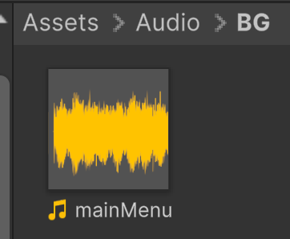
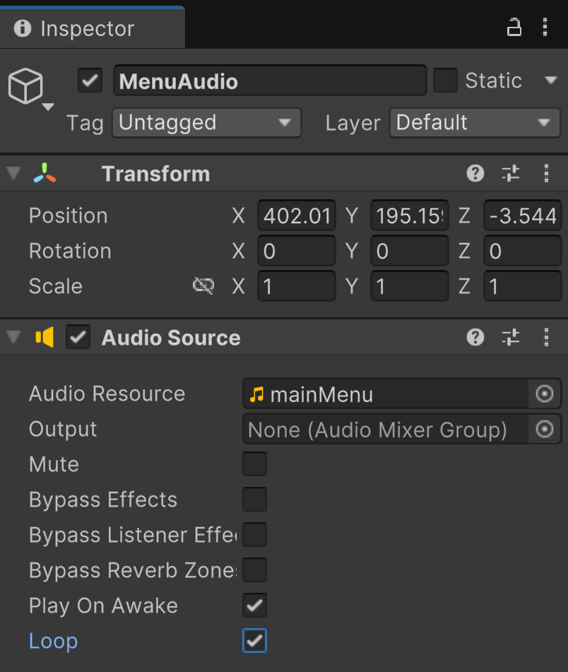
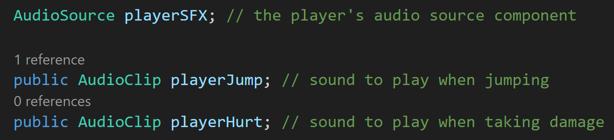
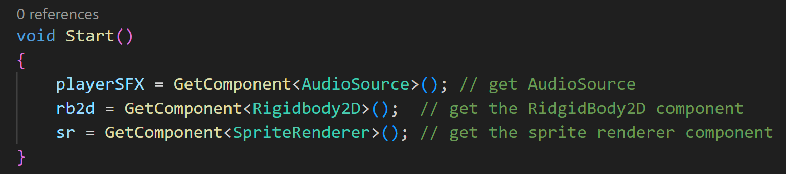
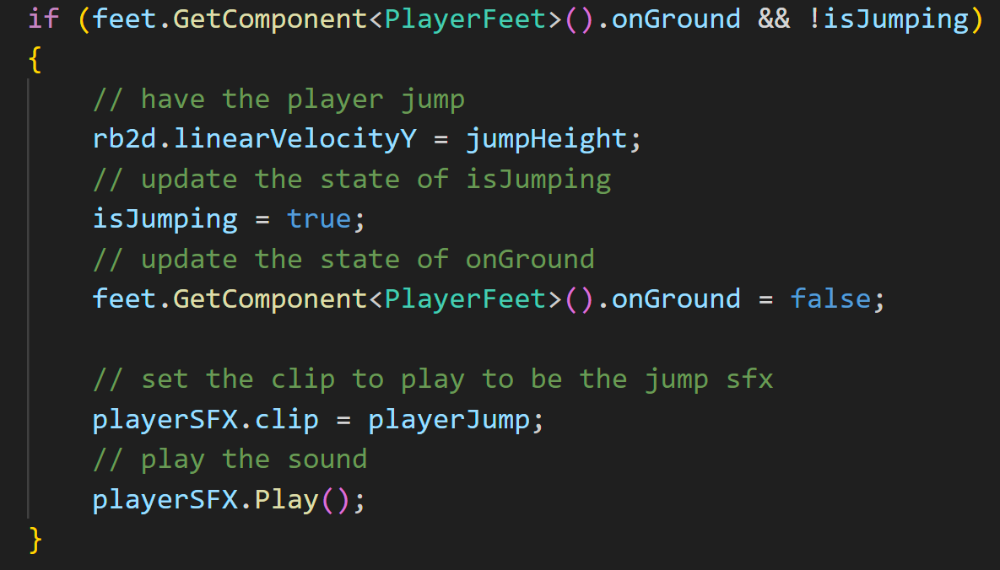
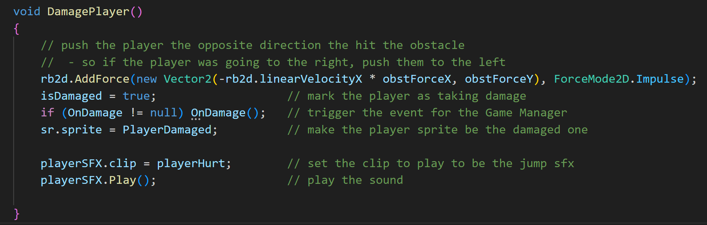
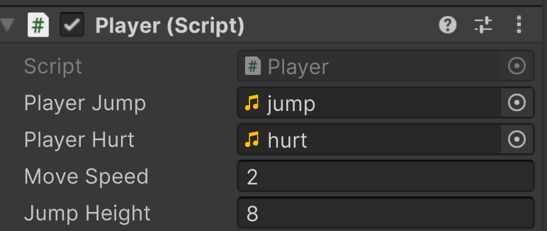

# Make Some Noise
---
An integral part of every game is sound. It can set the tone of the entire game

## Background Music
---

First I want to add some background music to my start menu.

I'm going to add a folder to my project named Audio. Inside that, I'm going to make a folder named BG (for background).
Then I'll drag and drop the music I want to use for my start menu:

To ge the audio into the game:

Right-click in the Hierarchy > Audio > Audio Source

I then named mine to MenuAudio. In the inspector for MenuAudio, I make mainMenu the Audio Resource to play. Then I'm going to 
check Loop so that it repeats. As long as Play On Awake is checked, it will automatically start playing when the game starts:

And that's it for background music that you just want to play forever.

## Triggering Sounds
---
What about sounds that we only want to play when certain events happen? Let's look at adding some sounds to our player.

Add an Audio Source component to the Player object. Then open the Player script. First I want to create a reference to 
the Audio Source component and two sounds that I want to play:

Then in Start(), get the audio source:

Now in PlayerInput() where we make the player jump:

Then we can do the same in DamagePlayer():

Back in the Player object, fill in the references:

---
>Prev: [Start Screen](/01_Start/START.md) | Next: [Some Common Platformer Mechanics](/03_Mech/MECH.md)