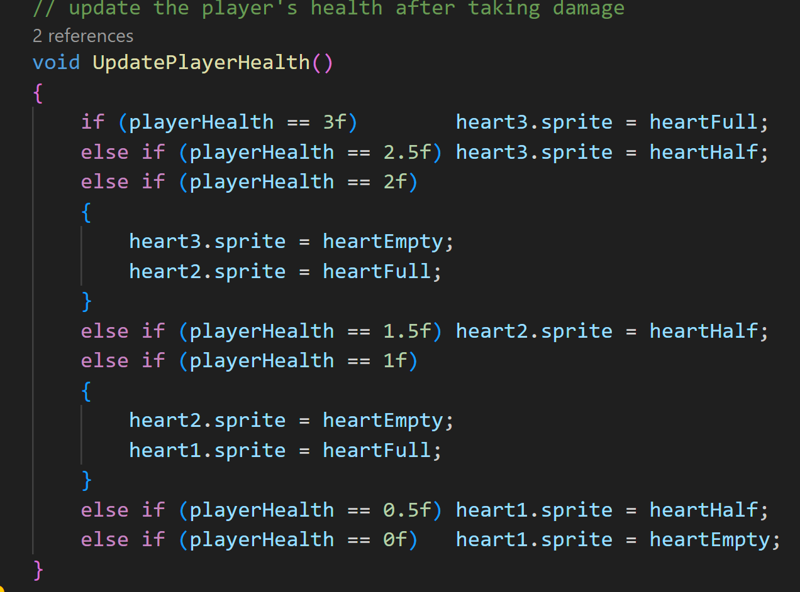

# Some Common Platformer Mechanics
---
Below are a few examples of common mechanics found in 2D platformers.

## Running
---
For running, I'm choosing to use the left-shift key. First I'm going to make a variable that we can tweak to find a good run amount:

I also want to make a bool to keep track of if the player is currently running or not:

Then in PlayerInput(), I'll add this if-else statement (I want to happen before we move the player):

Then see the results:

## Double Jump
---
First I want to make a variable to keep track of the number of times the player has jumped:

In PlayerInput(), let's first make sure to reset jumpCount whenever the player touches the ground:

When we check to see if the space key is being pressed, we want to change it from GetKey to GetKeyDown. Then:

Then see the results:

## Collectibles and Power-Ups
---

This could be anything. It could be a health-pack, a new ability for the player, coins, a key, or whatever. This is more
of a basic template of how to implement a pick-up system. Since we can lose health, I want to make a way to gain some back.

I'm going to quickly make a health pill by adding a 2D sprite capsule to the scene, and then adding a heart that I used for the UI as a child.
Then sizing each and changing the color of the capsule:

Now I renamed it to HealthPickup, added a BoxCollider2D component, and made the collider a trigger. Also, create and add the tag of Health.

In the player script we want to create another event to trigger:

Then check for the collision trigger:

Now in the game manager script we can add health. First I want to change things a little just to make it easier to see what's going on.
I'm going to create a function to add health and one to subtract health. Then each of those functions will call the UpdateHealth function:

We also want to update the UpdatePlayerHealth function so that it can update the health UI correctly since we can now gain back health:

Then in start, we'll change it so that when the player trigger OnDamage we subtract health and when a pickup is triggered we add health:

Then see the results:

